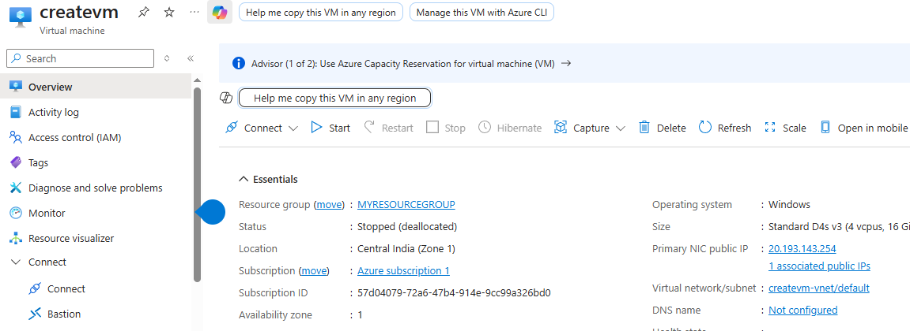
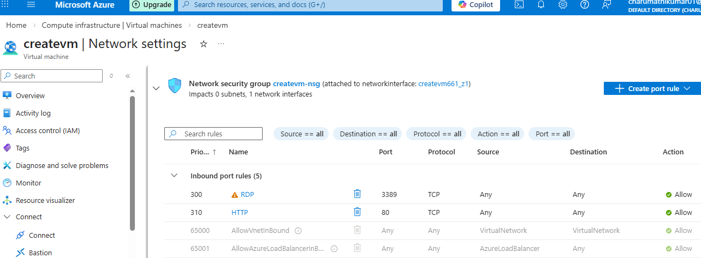
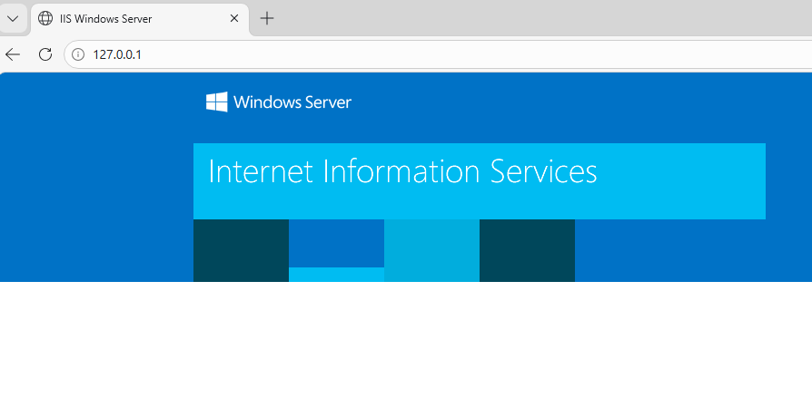

# Azure-VM-IIS-project
This project demonstrates the creation and configuration of an Azure Virtual Machine and IIS web server

Services Used:

Azure Virtual Machine

Windows Server

IIS Web Server

Networking

Public IP

Steps Performed:

1.Created Resource Group

2.Created Virtual Machine

3.Enabled RDP

4.Installed IIS Web Server

5.Hosted Web Page

7.Accessed website using Public IP

Project Screenshots:

VM Overview

RDP Connection

Networking

Public IP Website

Outcome

Successfully deployed and hosted a web server using Azure Virtual Machine and IIS.

Created by

Charumathi
